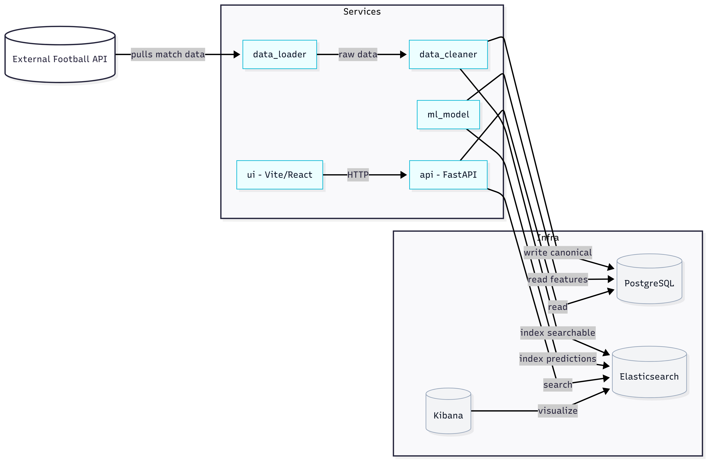

# Playmaker - Football Analytics App

[](https://www.python.org/downloads/release/python-3110/)
[](LICENSE)

<!-- Project stats -->
[](https://github.com/MotiWolff/Playmaker/stargazers)
[](https://github.com/MotiWolff/Playmaker/network/members)
[](https://github.com/MotiWolff/Playmaker/pulls)
[](https://github.com/MotiWolff/Playmaker/issues)
[](https://github.com/MotiWolff/Playmaker/graphs/contributors)

End-to-end football analytics pipeline: ingest match data → Kafka → PostgreSQL (normalized data) + Elasticsearch (search/indexing) → ML model scoring → FastAPI → Vite UI.

## Collaborators
<p align="left">
  <a href="https://github.com/MotiWolff" title="Moti Wolff - Team Lead"></a>
  <a href="https://github.com/DanielGFisher" title="Daniel Fisher"></a>
  <a href="https://github.com/YosefGu" title="Yosef Guchafi"></a>
  <a href="https://github.com/ydovzucker" title="Dov Zucker"></a>
  <a href="https://github.com/isaac11-tech" title="Isaac Tunik"></a>
  <a href="https://github.com/David-396" title="David Eini"></a>
</p>

<details>
<summary>Names and profiles</summary>

- Moti Wolff - Team Lead ([@MotiWolff](https://github.com/MotiWolff))
- Daniel Fisher ([@DanielGFisher](https://github.com/DanielGFisher))
- Yosef Guchafi ([@YosefGu](https://github.com/YosefGu))
- Dov Zucker ([@ydovzucker](https://github.com/ydovzucker))
- Isaac Tunik ([@isaac11-tech](https://github.com/isaac11-tech))
- David Eini ([@David-396](https://github.com/David-396))

</details>

## Contents
- Overview
- Diagram
- Why this design
- Architecture (services & infra)
- How to run
- Query API
- Troubleshooting

## Overview
The system ingests football match data from external APIs, cleans and enriches it, stores relational data in PostgreSQL, indexes searchable fields in Elasticsearch, applies an ML model for predictions/analytics, and exposes a FastAPI service consumed by a Vite/React UI.

## Diagram


## Why this design
- Microservices keep each responsibility small and independently debuggable/scalable.
- Kafka decouples producers/consumers and tolerates bursts and restarts.
- Dual storage plays to strengths: PostgreSQL for relational queries, Elasticsearch for search/analytics.
- Centralized logging makes cross-service traceability simple.
- Ingestion modes: live API ingestion and batch backfills to support both iteration and throughput.
- Model hyperparameters are configurable via environment variables for transparent, tunable behavior.

### Libraries rationale 
- FastAPI: modern, fast Python web framework for the API service.
- Kafka Python client: reliable messaging between loader/cleaner/model.
- Elasticsearch client: robust indexing and querying.
- Scikit-learn/NumPy/Pandas (typical stack) for feature engineering and modeling.

## Architecture
- Services
  - data_loader: pulls football data (API), publishes to Kafka and/or persists to PostgreSQL/Elasticsearch.
  - data_cleaner: consumes events, cleans/transforms, and writes canonical records to storage.
  - ml_model: scores matches or computes analytics; configurable via `PROB_TEMPERATURE`, `PROB_SHRINKAGE`.
  - api: FastAPI gateway exposing read-only/business endpoints to the UI.
  - ui: Vite/React frontend consuming the API.
- Infrastructure
  - PostgreSQL, Kafka + Zookeeper, Elasticsearch (+ optional Kibana).

## Repo structure (current)
```
Playmaker/
├── services/
│   ├── api/
│   │   ├── Dockerfile
│   │   ├── main.py                 # FastAPI app (endpoints, DB joins, fallbacks)
│   │   ├── models.py               # Pydantic models
│   │   └── mock_database.py        # Mock data used as fallback
│   ├── data_loader/
│   │   ├── Dockerfile
│   │   ├── main.py
│   │   ├── manager.py
│   │   ├── postgres_connector.py
│   │   └── postgres_DAL.py
│   ├── data_cleaner/
│   │   ├── Dockerfile
│   │   ├── server.py
│   │   ├── main.py
│   │   ├── services/
│   │   │   ├── cleaner.py
│   │   │   ├── table_creation.py
│   │   │   └── table_fetcher.py
│   │   └── db/postgres_conn.py
│   ├── model/
│   │   ├── Dockerfile
│   │   ├── config/config.yaml
│   │   ├── feature_builder/        # features, adapters, validators
│   │   ├── predictor/              # pipeline, artifact loader, writer
│   │   ├── trainer/                # model training/metrics/registry
│   │   └── models/                 # packaged artifacts
│   └── odds_winner/
│       ├── Dockerfile
│       ├── app/                    # odds API (sqlite-backed)
│       └── odds.py
├── shared/
│   ├── docker-compose.yaml         # Orchestration (API, UI, Postgres, Kafka, ES, etc.)
│   ├── config.py
│   └── logging/
├── ui/
│   ├── Dockerfile                  # Nginx-based static serving with envsubst
│   ├── js/                         # vanilla JS app (pages/components)
│   └── src/                        # Vite/TS app (App.tsx, services)
├── scripts/                        # diagnostics
│   ├── test_model_from_db.py
│   └── test_es_logging.py
├── README.md
└── diagram.png
```

## How to run
1) Copy and edit environment variables
```
cp shared/.env.example shared/.env
# edit shared/.env as needed
```
2) Start the stack
```
cd shared
docker compose up -d --build
```
3) Access
- API: http://localhost:8000
- UI:  http://localhost:5173

Notes
- Local defaults use internal Docker hostnames for service-to-service; public ports are exposed on localhost.
- The `API_BASE_URL` for the UI defaults to `http://api:8000` inside Docker and can be overridden via env.

### Quick start (API + UI only)

If you already have a managed PostgreSQL (e.g., Render), export it and run only API+UI:

```
export DATABASE_URL="postgresql://<user>:<pass>@<host>/<db>?sslmode=require"
cd shared
API_BASE_URL=http://localhost:8000 DATABASE_URL="$DATABASE_URL" docker compose up -d --build api ui
```

### Full stack (Postgres/Kafka/ES/etc.)

```
cd shared
DATABASE_URL="$DATABASE_URL" docker compose up -d --build
```

### Local dev (without Docker)

- API live reload:
  ```
  uvicorn services.api.main:app --reload --port 8000
  ```
- UI (Vite) dev server:
  ```
  cd ui && npm i && npm run dev
  # Ensure the UI uses the local API
  export API_BASE_URL=http://localhost:8000
  ```

## Query API
Purpose: safe, read-only access for consumers.
- Base: `http://localhost:8000`
- Swagger UI: `http://localhost:8000/docs`

Example endpoints (may vary by implementation):
- `GET /health`
- `GET /competitions`
- `GET /teams`
- `GET /fixtures/upcoming_with_odds?competition_id=2021`
- `GET /model_metrics`
- `GET /analytics/competition_coverage`
- `GET /matches?team=...&season=...`
- `GET /predictions?match_id=...`
- `GET /search?q=...` (Elasticsearch-backed)

Admin (batch):
- `POST /admin/regenerate_predictions` — regenerate future fixture predictions with current model

## Troubleshooting
- Kafka client from the host should connect via the published port; services use the Docker network name `kafka:9092`.
- Elasticsearch may take time to become healthy; compose includes a healthcheck and service dependencies.
- Postgres credentials are loaded from `shared/.env`; ensure they match the `DATABASE_URL` used by services.
- If the UI cannot reach the API from the browser, set `API_BASE_URL=http://localhost:8000` in `shared/.env` and rebuild the `ui` service.
 - Managed DBs (Render, etc.) typically require `?sslmode=require` in `DATABASE_URL`.
 - If predictions look overly home-biased, update to latest API and run `POST /admin/regenerate_predictions`.

## Scheduled refresh (every 2 days)

A helper script is provided to pull fresh fixtures, update tables, and regenerate predictions:

```
python scripts/run_refresh.py
```

Environment required:
- `DATABASE_URL` (e.g., `postgresql://...?...sslmode=require`)
- `API_BASE_URL` (defaults to `http://localhost:8000`)
- `FOOTBALL_API_KEY` (if loader needs it)

To run every 2 days with cron (macOS/Linux):

```
crontab -e
# every 2 days at 03:15
15 3 */2 * * cd /path/to/Playmaker && API_BASE_URL=http://localhost:8000 DATABASE_URL=postgresql://... python scripts/run_refresh.py >> refresh.log 2>&1
```

Or with Docker (compose services up):

```
cd shared
API_BASE_URL=http://api:8000 DATABASE_URL=postgresql://... docker compose exec -T api python /app/scripts/run_refresh.py
```

–– For deeper details (env vars, thresholds, implementation), see the code under `services/*` and configuration in `shared/.env`.